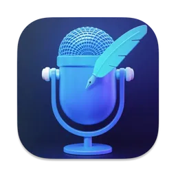

#  VoiceInk

  
  <h1>VoiceInk</h1>
  
Transform your voice into text, instantly.

  
  
  
  <!-- Add Discord badge once link is provided -->

   
  
  
  
  

    <a href="https://dub.sh/voiceinc">Official Download Link</a> • 
    <a href="https://github.com/Beingpax/VoiceInk/releases/latest">GitHub Release</a>
  

---

VoiceInk is a powerful macOS application that transforms your voice into text in real-time, providing a seamless and efficient way to capture your thoughts, create content, and transcribe audio.

## Features

- 🎙️ Real-time voice transcription
- 💻 Native macOS application
- 🚀 Powered by whisper.cpp for efficient, local transcription
- 🔒 Privacy-focused: All processing happens locally on your device
- ⚡ Fast and responsive interface
- 📝 Easy-to-use text editor

## Requirements

- macOS 14.0 or later

## Documentation

- [Building from Source](BUILDING.md) - Detailed instructions for building the project
- [Contributing Guidelines](CONTRIBUTING.md) - How to contribute to VoiceInk
- [Code of Conduct](CODE_OF_CONDUCT.md) - Our community standards

## Contributing

We welcome contributions! However, please note that all contributions should align with the project's goals and vision. Before starting work on any feature or fix:

1. Read our [Contributing Guidelines](CONTRIBUTING.md)
2. Open an issue to discuss your proposed changes
3. Wait for maintainer feedback

For build instructions, see our [Building Guide](BUILDING.md).

## License

This project is licensed under the GNU General Public License v3.0 - see the [LICENSE](LICENSE) file for details.

## Support

If you encounter any issues or have questions, please:
1. Check the existing issues in the GitHub repository
2. Create a new issue if your problem isn't already reported
3. Provide as much detail as possible about your environment and the problem

## Acknowledgments

Special thanks to the following projects and their maintainers:

### Core Technology
- [whisper.cpp](https://github.com/ggerganov/whisper.cpp) - High-performance inference of OpenAI's Whisper model

### Essential Dependencies
- [Sparkle](https://github.com/sparkle-project/Sparkle) - Keeping VoiceInk up to date
- [HotKey](https://github.com/soffes/HotKey) - Global shortcut support
- [KeyboardShortcuts](https://github.com/sindresorhus/KeyboardShortcuts) - User-customizable keyboard shortcuts
- [Defaults](https://github.com/sindresorhus/Defaults) - Modern user defaults management
- [LaunchAtLogin](https://github.com/sindresorhus/LaunchAtLogin) - Launch at login functionality

### Community
- All contributors who help make this project better
- The open-source community for their invaluable tools and support

---

Made with ❤️ by the VoiceInk team 